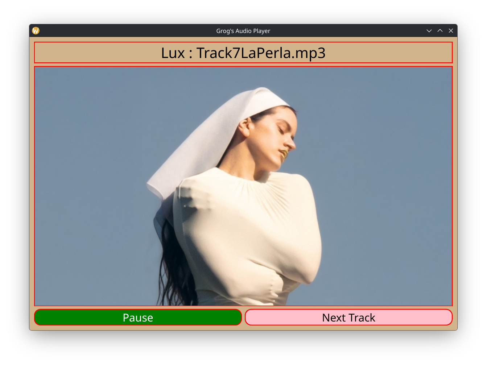

# Grog's Audio Player

### Author: Gregory Ecklund

### Version: April 2026

-------------

#### Background

I was listening to some music on Spotify and noticed that the shuffle feature wasn't truly random. This prompted me to look into music playing alternatives and couldn't find a basic one that I liked so I decided to just make my own.

#### Languages / Frameworks
Built upon C++, this program uses the Qt (version 6.11.0) framework for implementation and cmake (version 4.3.1) for building.

#### Project Structure
```
├── src/
│   ├── gamewindow.cpp   # Window Functionality
│   ├── gamewindow.h     # Class definitions
│   └── main.cpp         # Main entry-point
├── build/
│   ├── AudioPlayer      # Actual Executable Program
│   └── # Rest of folder contains cmake files
├── songs/
│   ├── AlbumOne/
│   │   ├── SongOne.mp3
│   │   ├── SongTwo.mp3
│   │   ├── SongThree.mp3
│   │   └── AlbumOne.jpg
│   ├── AlbumTwo/
│   │   ├── SongOne.mp3
│   │   ├── SongTwo.mp3
│   │   └── AlbumTwo.jpg
│   └── songs.txt        # List of songs (format shown below)
├── CMakeLists.txt       # Main cmake file
├── example.png          # Picture of program example
└── README.md            # This file
```

#### Setup
1. Create a 'songs' directory in the main working directory
2. Create subdirectories (albums) in 'songs'
3. The subdirectories must contain:
    - 'albumName'.jpg (must match directory name) {album art}
    - The songs in the 'album' in .mp3 format
4. Create a 'songs.txt' file in the 'songs' directory and format it like below
5. Good to go!

##### Formatting 'songs.txt'
Below is the valid songs.txt file for the above project structure. Note that the format is {AlbumName/SongName} without the file extension.
```
AlbumOne/SongOne
AlbumOne/SongTwo
AlbumOne/SongThree
AlbumTwo/SongOne
AlbumTwo/SongTwo
```

#### Running
Simply run the 'AudioPlayer' executable located in the build directory!

#### Building
Although building isn't necessary, the proper building procedure is to navigate to the 'build' directory and run:
```
cmake --build .
```

#### Coming Soon
In no particular order:
```
    Volume change functionality
    Playlist creation/editing from the GUI
    Visually change play, pause, and skip buttons
    Option for art per-song instead of per-album
```

#### Example Picture


### Thanks for taking the time to read this :)